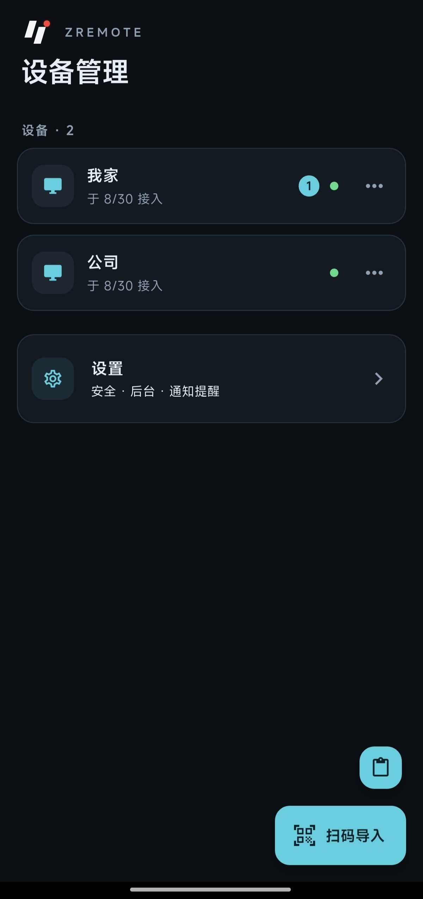
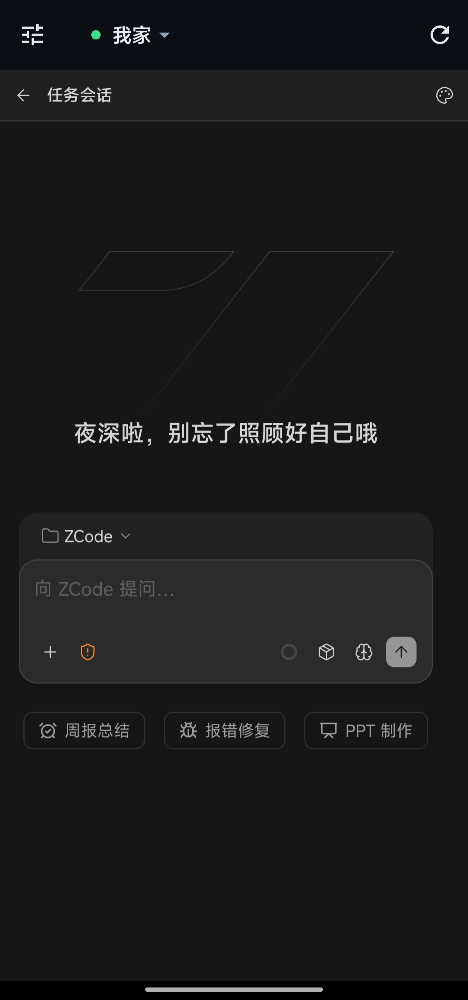
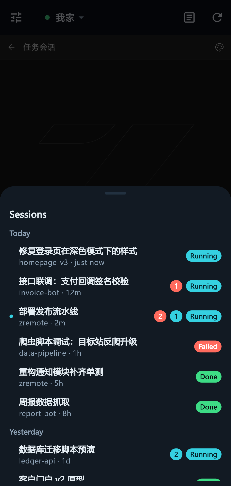

# ZRemote

[中文](README.md) | **English**

A mobile companion app for ZCode desktop remote control. The desktop shows a QR code; scan it once with your phone to import the device and it stays usable long-term. Manage multiple machines in parallel and switch between them in a single UI — plus automation tasks, activity benefits and usage stats right on your phone.

<p align="center">
  
  
  
</p>

## Features

- **Import via QR / paste** — scan the remote-control QR code shown by the desktop, or paste the control link, to add a device
- **Parallel multi-device sessions** — every device stays online at once; switching never reconnects
- **Session overview panel** — cross-project task cards at a glance: project · relative time · status capsule, grouped by today / yesterday / earlier; a live dot tracks the session currently being viewed, tap to jump straight to it
- **Toolbox** — one tap on the session top bar opens the toolbox: automation tasks, activity benefits and usage stats gathered in one place, with an aggregated dot for pending reminders
- **Automation task management** — create, edit, enable/disable and delete idle-time and scheduled tasks right on your phone; run state and queue status update live on each card, failure reasons in plain sight; schedules read as natural language like "Fridays at 18:00"
- **Activity benefit claiming** — claim limited-time plan offers in one tap; success shows up as a ticket-style dialog
- **App usage stats** — summary figures, a 30-day usage heatmap, daily per-model trends and model share; tap any day for that day's breakdown; switch between all-time / last 7 days / last 30 days
- **Task event notifications** — approval requests, task completions and failures arrive as system notifications; each type has its own toggle (approval only by default), with unread badges so nothing slips by in the background or on the lock screen; notifications retract automatically once the desktop side resolves the pending item
- **Background keep-alive** — a foreground guard service keeps sessions alive in background and with the screen off; battery-optimization whitelist guidance included, auto-recovers on return to foreground
- **Session health indicator** — per-device connection state at a glance (loading / connected / error)
- **One-tap refresh & auto recovery** — reload a broken session manually; repeated failures fall back to automatic reload, and sessions reconnect on their own after long stints in the background
- **Biometric gate** — lock the app with fingerprint / Face ID; verification required both to enable and to disable; lock screen carries the brand visual
- **Fresh visual design** — an industrial-style interface makeover: lock screen, scanner, import, session and settings, each screen re-crafted
- **Light & dark themes** — follow the system or pick light / dark manually; the web view inside a control session switches along with it
- **Chinese / English** — switch languages in-app, or follow the system language
- **Settings page** — Appearance (language, theme), Security & keep-alive, and Notification preferences in one place; the device list stays purely operational

## Download & Install

Get the latest build from the [Releases](https://github.com/pjpv/zremote/releases) page:

- **Android** — `app-release.apk`, install directly after downloading
- **iOS** — `zremote-ios-unsigned.ipa`, an **unsigned build that cannot be installed directly**: sideload it with your own Apple ID via [AltStore](https://altstore.io), [Sideloadly](https://sideloadly.io), TrollStore, or similar (free-account signatures last 7 days and must be renewed)

## Building

Requirements:

- Flutter ≥ 3.38 (Dart ≥ 3.10)
- JDK 17 (Android builds)
- Xcode (iOS builds, macOS only)

```bash
flutter pub get

# Android
flutter build apk --release

# iOS (unsigned)
flutter build ios --release --no-codesign
```

## Usage

1. Open remote control in ZCode on the desktop and show the QR code
2. Scan it with the app (or paste the link)
3. Tap a device card to open its control session; the top-bar title switches devices anytime
4. Open the top-bar toolbox for automation tasks, activity benefits and usage stats
5. When a task awaits approval or completes, a system notification arrives instantly; preferences live in the Settings page

## Disclaimer

ZRemote is a community-driven open-source project and is not an official tool; it is not affiliated with Z.ai. ZCode and related names and trademarks belong to their respective owners.

## License

[MIT](LICENSE)
